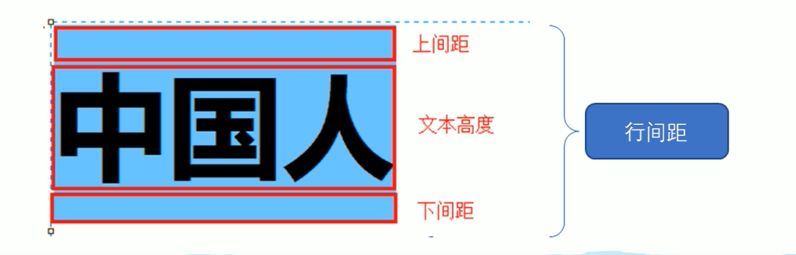
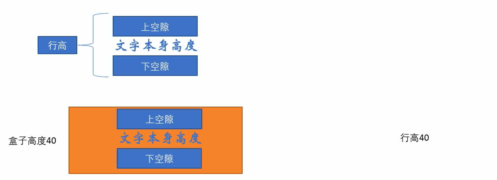

# 一、CSS概述

### 1.CSS简介

**层叠样式表**(英文全称：Cascading Style Sheets)，能够对网页中元素位置的排版进行像素级精确控制，支持几乎所有的字体字号样式，拥有对网页对象和模型样式编辑的能力。

### 2.CSS代码规范

```css
p {
    color: red;
    font-size: 20px;
}
```

- 标签和属性后面需要空格
- 各属性后面需用分号分隔

# 二、CSS第一阶段

### 1.CSS选择器

##### 1.1 标签选择器

```css
标签名 {
    属性1: 属性值1;
}

p {
    color: red;
    font-size: 20px;
}
```

- 属性值前面，冒号后面，保留一个空格
- 标签名和大括号中间保留空格

##### 1.2 类选择器

`css`

```css
.类名 {
    属性1: 属性值1;
    .....
}

.red {
    color: red;
}
```

`html`

```html
<div class='red'>  变红色 </div>
```

- 类选择器在HTML中以 class 属性表示，在CSS中，类选择器以一个点`.`号表示

##### 1.3 类选择器多类名

```css
<style>
        .box {
            width: 100px;
            height: 100px;
        }

        .red {
            background-color: red;
        }

        .green {
            background-color: green;
        }
</style>
```

`html`

```html
<body>
    <div class="red box">红色</div>
    <div class="green box">绿色</div>
    <div class="red box">红色</div>
</body>
```

- 可以把一些标签元素相同的样式(公共的部分)放到一个类里面

- 这些标签都可以调用这个公共的类，然后再调用自己独有的类

- 从而节省CSS代码，统一修改也方便

##### 1.4 id选择器

`css`

```css
<style>
        #lin {
            color:pink;
        }
</style>
```

`html`

```html
<body>
    <div id="lin">霖</div>
</body>
```

- id 属性只能在每个 HTML 文档中出现一次。
- 样式 **#** 定义，结构 **id** 调用，只能调用一次。

##### 1.5 类选择器和id选择器区别

- 类选择器（class）好比人的名字，一个人可以有多个名字，同时一个名字也可以被多个人使用
- id 选择器好比人的身份证号码，全中国是唯一的，不得重复
- id 选择器和类选择器最大的不同在于使用次数上
- 类选择器在修改样式中用的最多，id 选择器一般用于页面唯一性的元素上，经常和 JavaScript 搭配使用

##### 1.6 通配符选择器

```css
* {
    属性1：属性值1;
    ....
}

/*一般是用于清楚元素标签的内外边距*/
* {
    margin: 0;
    padding: 0;
}
```

##### 1.7 CSS选择器总结

|  基础选择器  |          作用           |                 特点                  |    使用情况    |      语法       |
| :----------: | :---------------------: | :-----------------------------------: | :------------: | :-------------: |
|  标签选择器  | 可以选出所有相同的标签  |            不能差异化选择             |      较多      | p {color: red}  |
|   类选择器   | 可以选出1个或者多个标签 |           可以根据需求选择            |     非常多     | .p {color: red} |
|  id 选择器   |   一次只能选择1个标签   | ID 属性只能在每个 HTML 文档中出现一次 | 一般和 js 搭配 | #p {color: red} |
| 通配符选择器 |     选择所有的标签      |       选择的太多，有部分不需要        |  特殊情况使用  | * {color: red}  |

### 2.CSS字体属性

##### 2.1 font-family(字体类型)

```css
body {
    font-family: "Microsoft Yahe",tahoma,arial,"Hiragino Sans GB";
}
```

- 各种字体之间必须使用英文状态下的逗号隔开
- 一般情况下，如果有空格隔开的多个单词组成的字体，加引号
- 建议用英文而不是中文表达字体

##### 2.2 font-size(字体大小)

```css
p{
    font-size: 20px;
}
```

- 谷歌浏览器默认的文字大小为 16px

##### 2.3 font-weight(字体粗细)

| **属性值** |                          **描述**                          |
| :--------: | :--------------------------------------------------------: |
|   normal   |           默认值(不加粗的)，相当于**number=400**           |
|    bold    |           定义粗体(加粗的)，相当于**number=700**           |
|   bolder   |                         定义特粗体                         |
|  100-900   | 400等同于 normal，700等同于 bold，注意这个数字后面不跟单位 |

- CSS使用font-weight属性设置字体的粗细
- 实际开发中，一般用**数字表示粗细**

##### 2.4 font-style(字体斜体)

| **属性值** |              **描述**              |
| :--------: | :--------------------------------: |
|   normal   | 默认值，浏览器会显示标准的字体样式 |
|   italic   |   浏览器会显示**斜体**的字体样式   |

- CSS使用font-style属性设置文字样式

##### 2.5 字体属性复合写法

`一般写法`

```css
<style>
        /*div标签 文字倾斜 文字加粗 字号16像素 微软雅黑*/
		/* 顺序：font-style font-weight  font-size/line-height  font-family */        

        div {
            font-style: italic;
            font-weight: 700;
            font-size: 16px;
            font-family: 'Microsoft yahe';
        }
</style>
```

`简单写法`

```css
<style>
		div {
            font: italic 700 16px 'Microsoft yahe';
        }
</style>
```

- 使用font属性时，必须按照语法格式顺序书写，**不能更换顺序**，并且各个属性间**以空格**隔开
- 不需要设置的属性可以省略(取默认值)，但必须保留`font-size` 和`font-family`属性，否则 font 属性将不起作用

##### 2.6 CSS字体属性总结

|    属性     |   表示   |                            注意点                            |
| :---------: | :------: | :----------------------------------------------------------: |
| font-style  | 字体样式 |  记住倾斜是 italic，不倾斜是 normal，实际开发最常用 normal   |
| font-weight | 字体粗细 | 加粗是 700 或者 bold ，不加粗是 normal 或者 400，记住数字不加单位 |
|  font-size  |   字号   |            我们通常用的单位是 px ，一定要跟上单位            |
| font-family |   字体   |                实际工作中按照团队约定来写字体                |
|    font     | 字体连写 | ①字体连写是有顺序的，不能随意换位置 ② **字体和字号必须同时出现** |

### 3.CSS文本属性

##### 3.1 color(文本颜色)

```css
div {
    color: red;
}
```

- 用于定义文本的颜色

|      表示      |                属性值                |
| :------------: | :----------------------------------: |
| 预定义的颜色值 |       red，green，blue，pink等       |
|    十六进制    |      #FF0000, #FF6600，#29D794       |
|    RGB代码     | rgb（255，0，0） 或rgb(100%，0%，0%) |

##### 3.2 text-align(文本位置)

```css
div {
    text-align:center;
}
```

- 用于设置文本内容的水平对齐方式

| 属性值 |      解释      |
| :----: | :------------: |
|  left  | 左对齐（默认） |
| right  |     右对齐     |
| center |    居中对齐    |

##### 3.3 text-decoration(文本下划线)

```css
div {
    text-decoration: underline;
}
```

- 用于装饰文本，可以给文本添加下划线，删除线，上划线等

|    属性值    |              描述              |
| :----------: | :----------------------------: |
|     none     |    默认。没有装饰线(最常用)    |
|  underline   | 下划线，链接自带下划线（常用） |
|   overline   |        上划线(几乎不用)        |
| line-through |        删除线 (不常用)         |

##### 3.4 text-indent(文本缩进)

```css
div {
    text-indent: 32px;
}

p{
   text-indent: 2em;
}
```

- 用于指定文本的第一行缩进，通常是将段落的首行缩进
- 通过设置该属性，所有元素的第一行都可以缩进一个给定的长度，如果设置负值会导致部分文字被遮挡
- em是一个相对单位，就是当前元素(font-size)**1个文字的大小**，默认一个文字大小16px
- 如果当前元素没有设置大小，则会按照父元素的一个文字大小

##### 3.5 line-height(文本行间距)

```css
p {
   line-height: 26px;
}
```

- 用于设置行间的距离(行高)，可以控制文字行与行之间的距离



##### 3.6 CSS文本属性总结

|      属性       |   表示   |                  注意点                  |
| :-------------: | :------: | :--------------------------------------: |
|      color      | 文本颜色 |    通常用十六进制，而且是简写形式 #FF    |
|   text-align    | 文本对齐 |        可以设定文字水平的对齐方式        |
|   text-indent   | 文本缩进 |               段落首行缩进               |
| text-decoration | 文本修饰 | 记住添加下划线 underline 取消下划线 none |
|   line-height   |   行高   |           控制行与行之间的距离           |

### 4.CSS样式表引入方式

##### 4.1 内部样式表

```html
<head>
    <meta charset="UTF-8">
    <meta http-equiv="X-UA-Compatible" content="IE=edge">
    <meta name="viewport" content="width=device-width, initial-scale=1.0">
    <title>Document</title>
    <style>
        .box {
            width: 100px;
            height: 100px;
        }

        .red {
            background-color: red;
        }

        .green {
            background-color: green;
        }
    </style>
</head>
```

- 通常在head标签里面，将样式写在<style>标签里

##### 4.2 行内样式表

```html
<div style="color: red; font-size: 20px;"></div>
```

- 在元素标签的内部的style属性中设定

##### 4.3 外部样式表

```html
<head>
    <meta charset="UTF-8">
    <meta http-equiv="X-UA-Compatible" content="IE=edge">
    <meta name="viewport" content="width=device-width, initial-scale=1.0">
    <title>Document</title>
    <link rel="stylesheet" href="#">
</head>
```

- 最常用，且可控制多个页面

### 5.综合案例(新闻首页)

完成页面请[查看代码](./代码/综合案例——新闻首页/news.html)

# 三、CSS第二阶段

### 1.emmet语法

- 生成单个标签，输入标签名，然后按下tab

- 生成多个标签，输入标签名加上\*，然后按下tab比如：**div*3**

- 生成父子标签，用>，比如**ul>li**或**ul>li*3**，然后按下tab

- 生成兄弟标签，用+，比如**p+a**，然后按下tab（默认生成div标签，想要生成其他标签如下：ul>li#lis）

- 生成有类名或id名的标签，输入**.demo**或**#id**，然后按下tab

- 生成有顺序的类名的div标签，输入$符号即可，比如**.demo$*5**

- 生成有内容的标签，输入{}符合即可，比如**div{生成内容标签}**

### 2.复合选择器

##### 2.1 后代选择器

```html
<style>
    ol li {
        color: red;
    }

    ul li a {
        color: green;
    }

    .nav li a {
        color: yellow;
    }
</style>
<body>
    <ol>
        <li>litest1</li>
        <li>litest2</li>
        <li><a href="#">变颜色</a></li>
    </ol>

    <ul>
        <li>litest1</li>
        <li>litest2</li>
        <li>litest3</li>
        <li><a href="#">变颜色</a></li>
    </ul>
    <ul class="nav">
        <li>litest1</li>
        <li>litest2</li>
        <li>litest3</li>
        <li><a href="#">变颜色</a></li>
    </ul>
</body>

元素1 元素2 {
    样式声明
}
```

- 元素1 和 元素2 中间用空格隔开
- 元素1 是父级，元素2 是子级，最终选择的是**元素2**
- 可以选择父元素里面的子元素

##### 2.2 子选择器

```css
元素1 > 元素2{
    样式声明
}

div > p{
    样式声明
}
```

- 元素1 和 元素2 中间用**大于号**隔开
- 元素1 是父级，元素2 是子级，**最终选择的是元素2**
- 元素2必须是**亲儿子**，其孙子、重孙之类都不归他管

##### 2.3 并集选择器

```css
元素1,元素2 {
    样式声明
}

ul,div {
    样式声明
}

ul,div,.nav li a{
    样式声明
}
```

- 元素1 和 元素2 中间用**逗号隔开**，最后一个不用逗号
- 并集选择器通常用于集体声明

##### 2.4 伪类选择器

`链接伪类选择器`

```html
<style>
        /* 1.未访问的链接 a:link 把未访问过（未点过的）的链接选出来 */
        a:link {
            color: #333;
            text-decoration: none;
        }
 
        /* 2. a:visited 选择点击过的（访问过的）链接 */
        a:visited {
            color: orange;
        }
 
        /* 3. a:hover 选择鼠标经过的那个链接  使其变颜色 */
        a:hover {
            color: skyblue;
        }
 
        /* 4. a:active 选择的是我们鼠标正在按下还没有弹起鼠标的那个链接 */
        a:active {
            color: green;
        }
 
        /* 为了确保生效，请按照 LVHA 的循顺序声明 :link - :visited - :hover - :active.  */
 
</style>
 
<body>
    <a href="#">test</a><br>
</body>
```

- 用冒号 **:** 表示，比如 **:hover. :first-child.**

`focus伪类选择器`

```css
input : focus {
    background-color:yellow;
}
```

- **:focus**伪类选择器用于**选取获得焦点的表单元素**
- 焦点就是光标，一般情况\<input>类表单元素才能获取

##### 2.5 复合选择器总结

|     选择器     |          作用          |       特征       | 使用情况 |              隔开符号及用法               |
| :------------: | :--------------------: | :--------------: | :------: | :---------------------------------------: |
|   后代选择器   |    用来选择后代元素    |  可以是子孙后代  |   较多   |          符号是**空格** `.nav a`          |
|   子代选择器   |    选择最近一级元素    |    只选亲儿子    |   较少   |          符号是**大于** `.nav>p`          |
|   并集选择器   | 选择某些相同样式的元素 | 可以用于集团声明 |   较多   |       符号是**逗号** `.nav,.header`       |
| 链接伪类选择器 |   选择不同状态的链接   |    跟链接相关    |   较多   | 重点记住`a{}`和`a:hover` ，实际开发的写法 |
|  :focus选择器  |   选择获得光标的表单   |    跟表单相关    |   较少   |        `input:focus` 记住这个写法         |

### 3.CSS元素显示模式

##### 3.1 块元素

- 常见的块元素有\<h1>~\<h6>、\<p>、\<div>、\<ul>、\<ol>、\<li>等，其中\<div> 标签是最典型的块元素。

- 块级元素的特点：
  - 比较霸道，自己独占一行
  - 高度，宽度，外边距以及内边距都可以控制
  - 宽度默认是容器（父级宽度）的100%
  - 是一个容器及盒子，里面可以放行内或块级元素

- 注意：
  - 文字类的元素内不能使用块级元素
  - \<p>标签主要用于存放文字，里面不能放块级元素，特别是不能放\<div>
  - 同理，\<h1>~\<h6>等都是文字类块级标签，里面也不能存放其他块级元素。

##### 3.2 行内元素

- 常见的行内元素有\<a>、\<strong>、\<b>、\<em>、\<i>、\<del>、\<s>、\<ins>、\<u>、\<span>等

- 其中\<span>标签是最典型的行内元素。有的地方也将行内元素称为内联元素。

- 行内元素的特点：
  - 相邻行内元素在一行上，一行可以显示多个
  - 高，宽直接设置是无效的
  - 默认宽度就是它本身内容的宽度
  - 行内元素只能容纳文本或其他行内元素

- 注意：
  - 链接里面不能再放链接
  - 特殊情况链接\<a>里面可以放块级元素，但是给\<a>转换一下块级模式最安全

##### 3.3 行内块元素

- 在行内元素中有几个特殊的标签\、\<input />、\<td>，它们同时具有块元素和行内元素的特点

- 有些资料称它们为内联元素

- 注意：
  - 和相邻行内元素在一行上，但是他们之间会有空白缝隙。一行可以显示多个(行内元素特点)
  - 默认宽度就是它本身内容的宽度(行内元素特点)
  - 高度，行高，外边距以及内边距都可以控制(块级元素特点)

##### 3.4 元素显示模式转换

- 转换为块元素： **display:block**
- 转换为行内元素： **display:inline**
- 转换为行内块元素：**display:inline-block**

##### 3.5 小技巧——设置垂直居中

`实现方式`

- **让文字的行高等于盒子的高度，就可以让文字在当前盒子内垂直居中**

```html
<!DOCTYPE html>
<html lang="en">

<head>
    <meta charset="UTF-8">
    <meta http-equiv="X-UA-Compatible" content="IE=edge">
    <meta name="viewport" content="width=device-width, initial-scale=1.0">
    <title>Document</title>
    <style>
        div {
            width: 200px;
            height: 80px;
            background-color: aqua;
            line-height: 80px;
            text-align: center;
        }
    </style>
</head>

<body>
    <div>居中</div>
</body>

</html>
```

`原理`



- 行高的上空隙和下空隙把文字挤到中间了
- 如果是行高小于盒子高度，文字会偏上，如果行高大于盒子高度，则文字偏下

##### 3.6 CSS元素显示模式总结

|  元素模式  |        元素排列        |        设置样式        |     默认宽度     |          包含          |
| :--------: | :--------------------: | :--------------------: | :--------------: | :--------------------: |
|  块级元素  | 一行只能放一个块级元素 |    可以设置宽度高度    |    容器的100%    | 容器级可以包含任何标签 |
|  行内元素  | 一行可以放多个行内元素 | 不可以直接设置宽度高度 | 它本身内容的宽度 | 容纳文本或其他行内元素 |
| 行内块元素 |  一行放多个行内块元素  |    可以设置宽度高度    | 它本身内容的宽度 |                        |

### 4.综合案例(小米导航栏)

完成页面请[查看代码](./代码/综合案例——小米导航栏/xiaomi.html)

### 5.CSS背景

##### 5.1 background-color(背景颜色)

```css
background-color: transparent;
```

- 默认颜色是**transparent（透明）**

##### 5.2 background-image(背景图片)

```css
background-image : none | url(url)
```

- **背景图片后面的地址不要忘记加URL，同时里面的路径不要加引号**。

##### 5.3 background-repeat(背景平铺)

```css
background-repeat: repeat| no-repeat| repeat-x| repeat-y
```

|  参数值   |                作用                |
| :-------: | :--------------------------------: |
|  repeat   | 背景图像在纵向和横向上平铺(默认的) |
| no-repeat |           背景图像不平铺           |
| repeat-x  |        背景图像在横向上平铺        |
| repeat-y  |         背景图像在纵向平铺         |

##### 5.4 background-position(背景位置)

```css
background-position: x y;
```

- 参数：X坐标 Y坐标

- 可以使用 方位名词 或者 精确单位

- 注意

  - 参数是方位名词
    - 如果指定的两个值都是方位名词，则两个值前后顺序无关，比如left top和top left
    - 如果只指定了一个方位名词，另一个值省略，则第二个值默认居中对齐
  - 参数是精准单位
    - 如果参数值是精确坐标，那么第一个肯定是x坐标，第二个一定是y坐标
    - 如果只指定一个数值，那该数值一定是x坐标，另一个默认垂直居中

  - 参数是混合单位
    - 如果指定的两个值是精确单位和方位名词混合使用，则第一个值是x坐标，第二个值是y坐标

##### 5.5 background-attachment(背景滚动)

```css
background-attachment : scroll | fixed
```

|  参数  |           作用           |
| :----: | :----------------------: |
| scroll | 背景图像是随对象内容滚动 |
| fixed  |       背景图像固定       |

##### 5.6 背景色半透明

```css
background : rgba(0,0,0,0.3);
```

- 最后一个参数是**alpha**透明度，取值范围在0~1之间

- 我们习惯把0.3的 0省略掉，写为**background(0,0,0,.3);**

- 背景半透明是指**盒子背景半透明**，**盒子内容不受影响**

##### 5.7 背景复合写法

```css
background : transparent url(image.jpg) repeat-y fixed top;
```

- background : 背景颜色 背景图片地址 背景平铺 背景图像滚动 背景图片位置

##### 5.8 背景总结

|         属性          |      作用      |                        值                         |
| :-------------------: | :------------: | :-----------------------------------------------: |
|   background-color    |    背景颜色    |          预定义的颜色值/十六进制/RGB代码          |
|   background-image    |    背景图片    |                   url(图片路径)                   |
|   background-repeat   |    是否平铺    |       repeat/ no-repeat /repeat-x/repeat-y        |
|  background-position  |    背景位置    |          length/position 分别是x 和y坐标          |
| background-attachment |    背景附着    |         scroll(背景滚动) /fixed(背景固定)         |
|       背景简写        |   书写更简单   | 背景颜色 背景图片地址 背景平铺 背景滚动 背景位置  |
|     背景色半透明      | 背景颜色半透明 | background : rgba(0,0,0,0.3);**后面必须是四个值** |

### 6.综合案例(五彩导航)

完成页面请[查看代码](./代码/综合案例——五彩导航/wucai.html)
